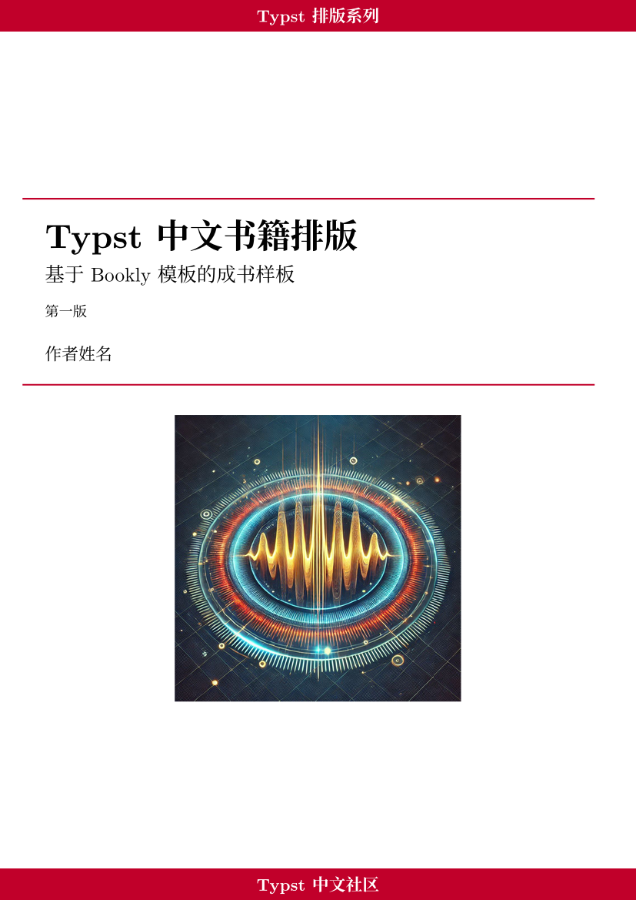
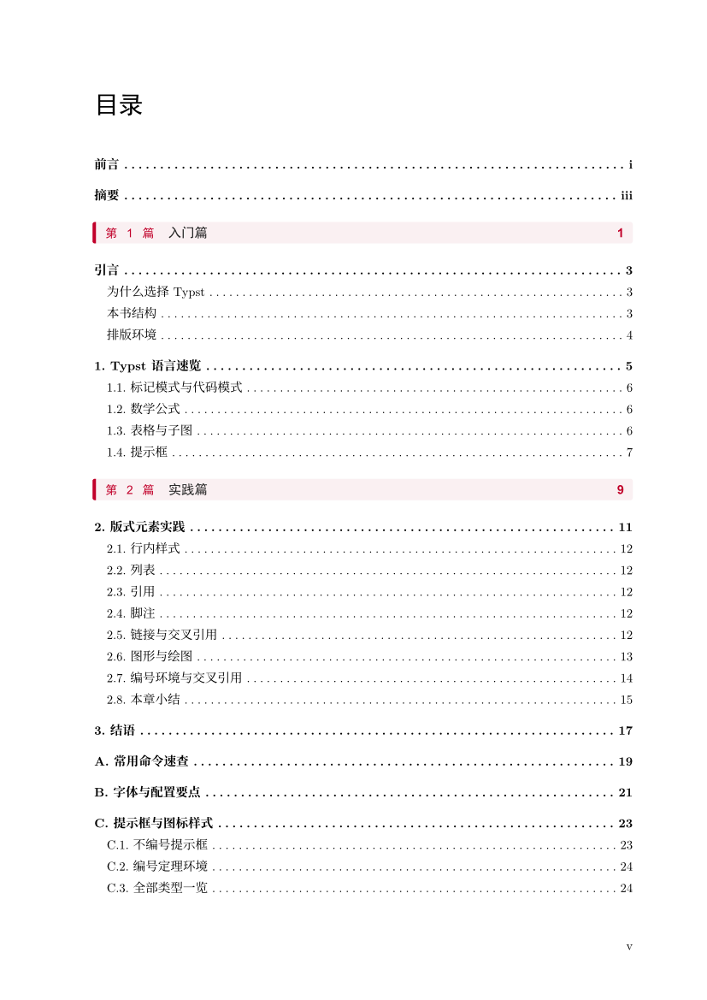
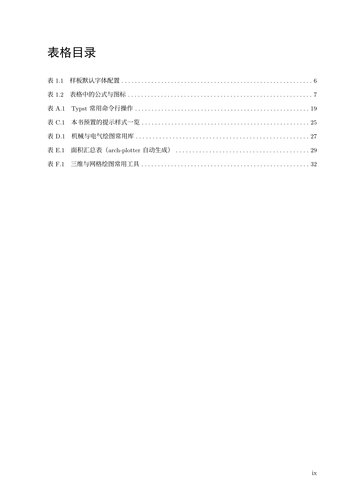
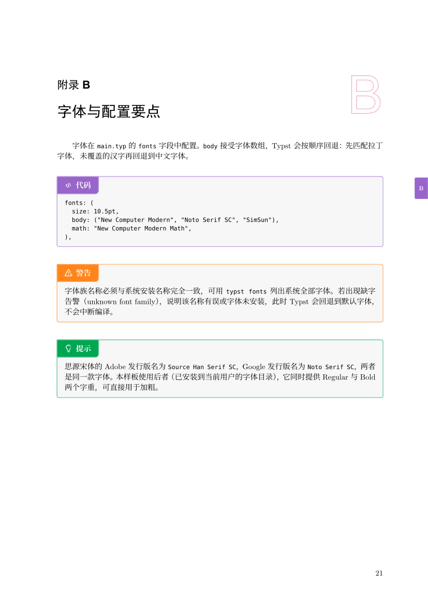

# typst-book-author

一个 Agent Skills 技能：用基于 [Bookly](https://typst.app/universe/package/bookly) 5.1.1
调校的 Typst 中文书籍样板排书。封面/版权页、目录（含「篇」行与图表目录）、
篇章页、切口色标、书眉、提示框与定理环境、图表公式、GB/T 7714 参考文献、
附录与封底开箱即用。内置六个主题色（朱砂、靛蓝、松绿、赭石、紫棠、石墨），
`colors.typ` 一行切换，全书签名色自动同步。

## 效果预览

| 封面 | 目录（篇行色条） |
| :---: | :---: |
|  |  |

| 篇章页（空心篇次数字 + 本篇小目录） | 正文（提示框 + 切口色标） |
| :---: | :---: |
|  |  |

## 目录结构

```
typst-book-author/
├── SKILL.md               技能入口：工作流程与文件一览
├── README.md              本文件
├── preview/               效果预览图
├── references/            按需阅读的参考文档
│   ├── design.md          版式架构与设计意图（改模块前读）
│   ├── customization.md   常见定制任务（换色/开本/边距/扩框型…）
│   └── pitfalls.md        踩坑记录（不收敛/标题消失/字体异常…）
└── template/              完整可编译的书籍样板
    ├── main.typ           入口：元数据、字体、目录规则、篇章结构
    ├── colors.typ         主题切换（六主题）与全书配色唯一来源
    ├── boxes.typ          提示框 / 定理环境 / 加框公式
    ├── figstyle.typ       CeTZ / Fletcher / Lilaq 统一图形样式
    ├── partpage.typ       篇章页与目录「篇」行
    ├── chaptermark.typ    章首页装饰章号、装订边距
    ├── runninghead.typ    书眉
    ├── pagetabs.typ       切口色标（拇指索引）
    ├── front_matter/  chapters/  appendix/   内容示例（即用法文档）
    └── bibliography/  images/  data/         文献库与素材
```

## 安装

把本文件夹放进技能目录即可，支持 [Agent Skills](https://agentskills.io) 规范的工具会自动发现：

```
~/.agents/skills/typst-book-author/     # 个人技能（所有项目可用）
<项目>/.agents/skills/typst-book-author/  # 仅当前项目
```

## 使用

对支持 Agent Skills 的 AI 编程助手说「帮我把这些笔记排成一本书」「用 Typst 写一本中文教材」之类的话，
技能会自动触发：复制 `template/` 到你的项目、改元数据、替换内容、给出编译命令。
也可以直接手动使用模板：

```bash
cp -r template/ mybook/ && cd mybook
# 编辑 main.typ（书名/作者）与 chapters/ 下的章节
typst compile main.typ 我的书.pdf
```

要求 Typst 0.15+，首次编译需联网拉取 `@preview` 依赖。字体依赖：
思源宋体（Noto Serif SC）、SimHei、KaiTi、New Computer Modern、DejaVu Sans Mono。

## 依赖

- [Bookly](https://typst.app/universe/package/bookly) 5.1.1（书籍骨架）
- [CeTZ](https://typst.app/universe/package/cetz) / [Fletcher](https://typst.app/universe/package/fletcher) /
  [Lilaq](https://typst.app/universe/package/lilaq)（图形）
- [Heroic](https://typst.app/universe/package/heroic)（Heroicons 图标）
- 附录 app4–app6 的工程绘图示例另需 zap、bone、mechanical-system-cetz-34j、
  arch-plotter、maquette、plotsy-3d、vmesh；其中 app4 的 cetz 固定为 0.5.0
  （mechanical-system 按它构建），与 figstyle 的 0.5.2 并存属有意为之，勿合并升级。

## 许可

[MIT](LICENSE)
